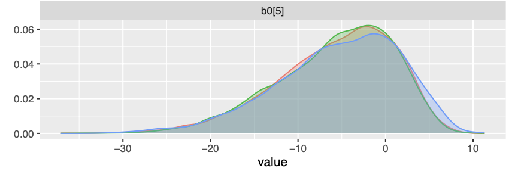
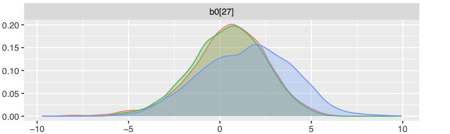
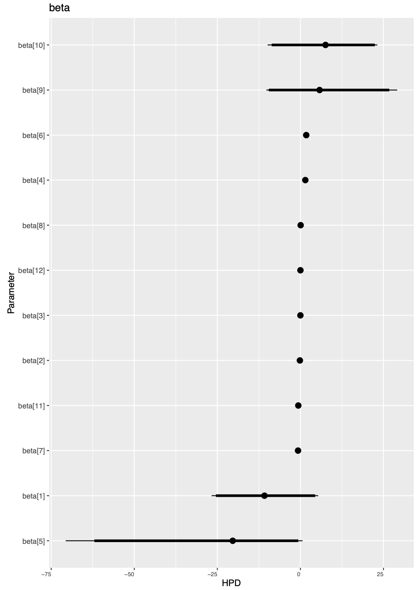
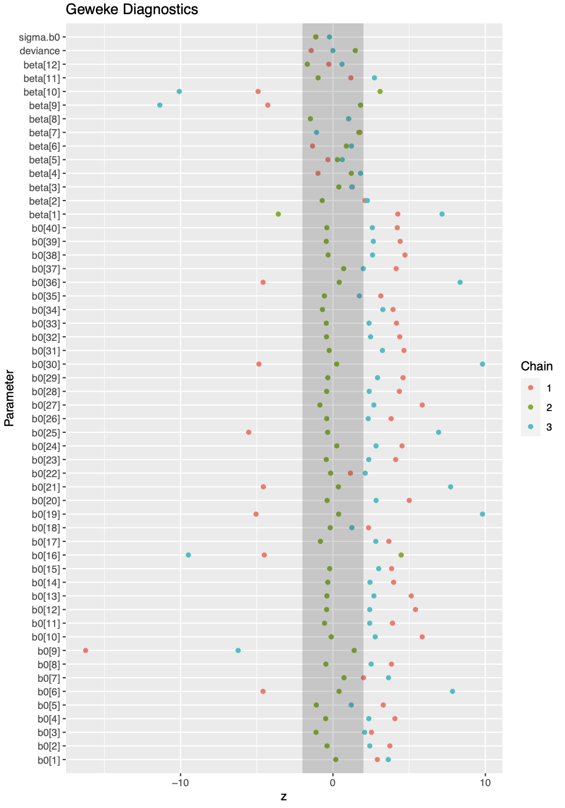

```{r setup, include=FALSE}
rm(list = ls())
knitr::opts_chunk$set(echo = FALSE)
library(lme4)
library(R2jags)
library(ggplot2)
library(tidyverse)
load('Rdata/shots.RData')
```

## Introduction (1)

Nowdays, football clubs have started to analyze advanced
metric for player performance analysis that can lead in

- player scouting
- decision making of player’s contract.


## Introduction (2)


While comparing teams or player, the expected goal metric provides a
good statistic in the tactical match analysis. 

The xG model is a probabilistic model that assign score between 0 and 1 from any
observed shot in a match. The model has development using
event-level football data from StatsBomb’s data.

Usually, xG models do not account fot the players
who take the shots, and this assumptions does not seem suitable, 
since the player’s skill could influence the success of shot-
conversion. 

## Aim 


The aim of the analysis is to understand:

- The variables that can influence the shots result
- If there is a hierarchical structure behind the shots
- Estimate the player effect on goal scoring

Before going any further on the analysi, it is needed to describe the variables that we are going to use for conducting this analysis

##  Dataset

The data are collected by tracking players over the course of
football matchs and recording their actions such shots, passes
or others. For the xG model the data were taken from the
shot event. These data, collected from StatsBomb, are spatially manipulated in order
to extrapolate relevant informations for the score prediction.


## Data extrapolation


{width=50%}


## Dataset description 

The dataset is composed by 13 variables and 7437 observations that reppresent shots of different $40$ player of Barcelona F.C.

- Three continuous predictors: shot-taker’s distance to goal,
angle of shot and time.
- Three binary predictors: tecnique, first touch, inside 18
metres
- Two multi-class predictors: body part and preferred type

## Explanatory Analysis


```{r Bar plot of goal}
barca_shot <- shots[shots$team == "Barcelona",]

barplot(prop.table(table(barca_shot$goal)),
        main = "Bar plot of shots results",
        names.arg = c("No score","Score")
        )

```


## Explanatory Analysis (2)

```{r plot number of goal vs distance}
barca_shot$goal <- as.integer(factor(barca_shot$goal))
distance_class <- factor(cut(barca_shot$shot_distance , breaks = c(0,5,10,15,20,25,30)))
plot(distance_class[ barca_shot$goal == 1], main = "Number of goal per distance class",
     xlab = "Distance class" , ylab = "Number of goal")
```


## Hierarchical assumptions

A reasonable assumption is that player has a unique type of
shooting. Therefore, given a player, the shots are inerehntly
correlate to each other and behave indipendently from the
shot of another players. This introduces within-player correla-
tions. As a result, every shot is essentially grouped under a player. Therefore,
models need to be fed information about the hierarchical structure, otherwise it may lead to biased inference.


## Example of the hierarchical structure


{width=50%}


## Model specification


For targeting the target variable, two models are choosen.

- GLM (Generalize linear model):  do not fed information about the hierarchical structure
- GLMM (Generalize linar mixed model): do fed information about the hierarchical structure

## Generalized linear model specifications

$$g(\pi_i) = \beta_0 + \beta_1 x_1 + \cdots + \beta_p x_p$$
where:

- $g$ is the logit link function 
- $\pi_i$ is the odds for a goal $\frac{Pr(Y = 1)}{Pr(Y = 0)}$.

## Generalized linear mixed model specifications

In order to fed the information about the players structure a Linear mixed effect model only with a random intercept it is choosen. 

Let us define the equation of the model and some basic notion:


$$g(\pi_{i,j}) = \beta_0 + \beta_1 x_{i,j,1} + \beta_2 x_{i,j,2} \cdots \beta_p x_{i,j,p} + \delta_j $$
\begin{itemize}
    \item $g = 1,2, \dots 42$ number of players
    \item $i = 1 \dots n_g$ Number of shots done by the $g-th$ player
    \item $\pi{_i,g} =  $  odds ratio of score from  the $i-th$ shot and the $g-th$ player
\end{itemize}


## Dimensionality of the parameters

Let us define the dimensionality:

\begin{itemize}
    \item $X_{g,i} \in (k \times 1)$ where $k$ is the number of predictors.
    \item $\underline{\beta} \in (k \times 1)$ can be considered as a vector of fixed effect since it does not depend on the player.
    \item  $\delta{j}$ represent the random effect linked to the g-th player.
    \item The vector $\underline{\epsilon_{g}}$ is the vector of error terms.
\end{itemize}


## Sampling model assumptions

The $\epsilon_g$ $\perp$ $b_g \forall g = 1 \cdots 42$.
The $b_g$ are normally distribuited with their own variance.
The $\epsilon_g$ are normally distribuited.

Conditionally on the group effect, the probability of scoring 
can be considered independent since we are deleting their common factors.

## Poterior Analysis Distribution of the beta coefficient

```{r beta coef , warning=FALSE , echo=FALSE , comment=FALSE, fig.height=5.6}
load("Rdata/glmm.jags_model.RData")
load("Rdata/glm.jags_model.RData")

# Reshape the dataframe into a long format
load("Rdata/df_long.RData")


ggplot(df_long, aes(x = value, fill = variable)) +
  geom_density(alpha = 0.5) +
  facet_wrap(~ variable, ncol = 1, scales = "free_y") +
  theme_minimal() +
  theme(axis.text.y = element_blank(), axis.ticks.y = element_blank()) +
  xlim(-5,5)
```


## Betas coefficient

\begin{table}[b]
\begin{center}


    
\begin{tabular}{|l|l|}
\hline
Predictors              & Mean posterior distribution \\ \hline
$\beta_{1}$: Intercept                & -10.933   \\ \hline
$\beta_{2}$: shot\_distance           & -0.1548  \\ \hline
$\beta_{3}$: shot\_angle              & -0.0010   \\ \hline
$\beta_{4}$: bodypartLeft Foot        & 1.481   \\ \hline
$\beta_{5}$: bodypartOther Bodypart   & -24.49   \\ \hline
$\beta_{6}$: bodypartRight Foot       &  1.7626   \\ \hline
$\beta_{7}$: techniqueVolley         & -0.712  \\ \hline
$\beta_{8}$: first\_touchTrue       &  0.077  \\ \hline
$\beta_{9}$: prefered\_typeLeft Foot & 7.394   \\ \hline
$\beta_{10}$: prefered\_typeRight Foot &  7.87   \\ \hline
$\beta_{11}$: inside\_18True          & -0.639  \\ \hline
$\beta_{12}$: time              & 0.0081  \\ \hline
\end{tabular}
\end{center}

\end{table}


## Player impact on goal

The random effetct associated to each player can be seen as a measuere of player inpact on goal,
a positive random effect for player means more likelihood that a shot will end up in a score.

{width=50%}
{width=50%}

## Model comparison via DIC


\begin{align*}
\begin{cases}
H_0 : \sigma_{b_0} = 0\\
H_1 : \sigma_{b_0} > 0
\end{cases}
\end{align*}

```{r comparison via dic}
load("Rdata/glmm.jags_model.RData")
paste("DIC GLMM:" , true.model.jags[["BUGSoutput"]][["DIC"]])
load("Rdata/glm.jags_model.RData")
paste("DIC GLM:" , true.model.jags[["BUGSoutput"]][["DIC"]])
```


Since the DIC the GLM is lower than the DIC of the GLMM , it is possible to claim that data do not show enough evidence in order to rejcet the null hypothesis.

So we can conlcude that the assumptions of the hierarchical structure does not fit with this data


## DIAGNOSTIC

{width=40%}


## DIAGNOSTIC (2)

{width=40%}


## References

todo


